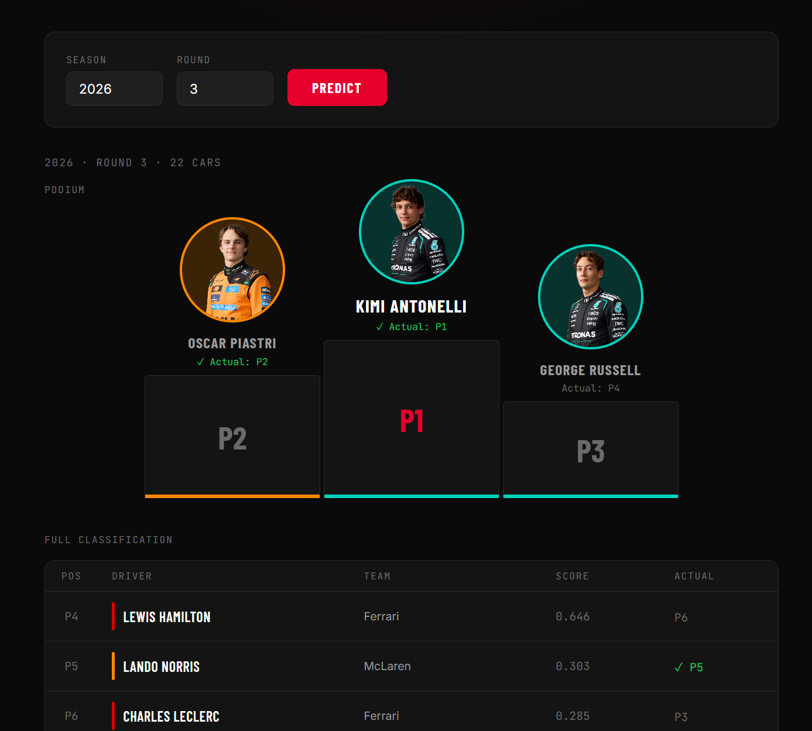
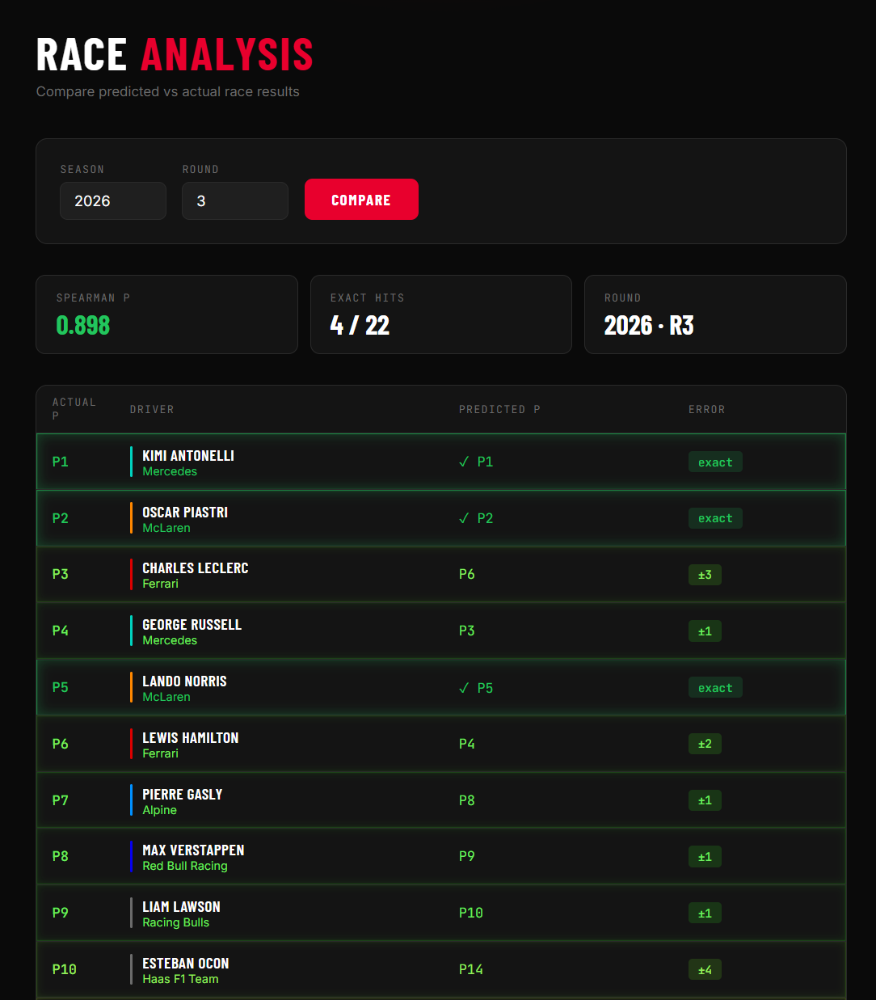

# F1Net-V2

A neural learning-to-rank system for predicting Formula 1 race results, with a fully automated continuous training pipeline that retrains after every race weekend.

---

## Overview

F1Net-V2 predicts the finishing order of all 22 drivers in an F1 race weekend using pre-race data — qualifying times, free practice pace, grid positions, and historical driver/team form. The model outputs a ranked list of drivers by predicted finishing position.

The 2026 season introduced a major regulation change, making 4 years of historical training data partially obsolete. F1Net-V2 handles this through a two-phase training strategy: pretraining on 2022-2025 data, then adapting to 2026 using Elastic Weight Consolidation (EWC) to prevent catastrophic forgetting of historical knowledge while learning the new competitive order.

After each race weekend, the pipeline automatically ingests new data, finetunes the model, and pushes updated weights to DVC — no manual intervention required.

### Predict


### Compare

---

## Architecture

```
FastF1 API
    │
    ▼
Ingest Service (FastAPI)          ← pre-race: FP + Quali data
    │                             ← post-race: FinishPos + GridPos
    │  writes CSV
    ▼
DVC-tracked Dataset ──────────────► Git/DagsHub (version controlled)
    │
    ▼
Finetune Service (FastAPI)        ← triggered automatically post-race
    │   EWC + rolling window (last 6 races)
    │   logs to MLflow on DagsHub
    ▼
Updated Model Checkpoint ─────────► DVC push
    │
    ▼
Predict Service (FastAPI)         ← reads latest checkpoint + dataset
    │
    ▼
React Frontend                    ← Predict, Compare, Admin pages
```

---

## Project Structure

```
F1Net-V2/
├── src/
│   ├── api/          # FastAPI services (predict, ingest, finetune)
│   ├── models/       # F1Net architecture + ListNet loss
│   ├── utils/        # Dataset loader, preprocessing
│   └── training/     # Pretraining + Fisher matrix computation
├── f1net-frontend/   # React + Vite frontend
├── docker/           # Dockerfiles for all four services
├── config/           # Driver/team ID mappings
├── data/             # DVC-tracked dataset
├── checkpoints/      # DVC-tracked model weights + Fisher matrix
├── assets/           # README screenshots
├── docker-compose.yml
└── requirements.txt
```

---

## Model

F1Net is a learning-to-rank model trained with ListNet loss (KL divergence between predicted and target softmax distributions).

**Input features per driver:**
- Driver embedding (learned, 16-dim)
- Team embedding (learned, 16-dim)
- Numeric features: qualifying time, qualifying delta to pole, average FP pace, grid position, rolling 3-race finish average

**Architecture:**
- Embedding layers for driver and team IDs
- Feature projection MLP
- Scoring head → single scalar per driver
- Rankings derived by sorting predicted scores

**Loss:** KL divergence between `softmax(scores / T)` and `softmax(targets / T)` where temperature `T = 3.4` (found via Hyperopt). Higher temperature flattens the target distribution, providing better gradient signal for mid-field predictions rather than only optimizing the top positions.

**Evaluation:** Spearman rank correlation across all 22 positions. Reached ~0.75 on the 2022-2025 held-out test set after pretraining.

**2026 adaptation:** Two-phase training strategy:
- Phase 1: Pretrain on 2022-2025 data with all parameters unfrozen
- Phase 2: Freeze driver embeddings (preserve historical driver knowledge), allow team embeddings and other layers to adapt to new 2026 car characteristics
- New drivers (Arvid Lindblad) and teams (Cadillac) initialized from a "rookie" baseline index and updated via gradient masking

---

## Continuous Training Pipeline

After each race weekend, the pipeline runs end-to-end automatically:

1. **Pre-race** — call `/ingest` with year and round number. Fetches FP1/FP2/FP3 + qualifying data from FastF1, preprocesses, and appends to the master dataset with `FinishPos = null`
2. **Post-race** — call `/ingest/finish`. Fills in actual finishing positions from the race session, recomputes rolling averages, triggers finetune automatically
3. **Finetune** — EWC-regularized finetuning on a rolling window of the last 6 races. EWC lambda = 10, 10 epochs, Adam lr = 0.003. Pre/Post Spearman logged to MLflow on DagsHub, updated checkpoint saved and pushed via DVC

**EWC (Elastic Weight Consolidation):** Adds a regularization term to the loss penalizing parameter drift from the pretrained weights, weighted by the Fisher information matrix (computed once on the full training set). This allows the model to learn new race patterns without forgetting 2022-2025 knowledge.

```
L_total = L_new + (λ/2) * Σ F_i * (θ_i - θ_pretrained_i)²
```

**Data versioning:** Every dataset and checkpoint update is tracked with DVC, committed to git, and pushed to DagsHub — full lineage from raw FastF1 data to model weights.

---

## API Services

Three independent FastAPI services, each containerized separately:

**Ingest (port 8000)**
Fetches race weekend data from FastF1. Split into two endpoints because pre-race data (FP + Quali) is available Friday/Saturday while race results only exist Sunday evening. Running them separately avoids blocking predictions on race data availability.
- `POST /ingest` — pre-race ingestion (FP + Quali)
- `POST /ingest/finish` — post-race: fills FinishPos, triggers finetune
- `GET /ingest/status/{job_id}` — async job polling
- All write operations protected by `X-API-KEY` header

**Predict (port 8001)**
Loads model checkpoint and serves ranking predictions. Reads dataset fresh on each request to pick up new races ingested since startup.
- `POST /predict` — takes `{year, round_num}`, returns ranked predictions with driver, team, predicted position, actual position (if available), and exact match flag

**Finetune (port 8002)**
Runs EWC finetuning on the rolling window dataset. Triggered automatically by ingest/finish but can also be called manually.
- `POST /finetune` — queues async finetune job
- `GET /finetune/status/{job_id}` — job status polling

---

## Tech Stack

| Layer | Technology |
|---|---|
| Model | PyTorch, custom ListNet loss |
| Hyperparameter tuning | Hyperopt |
| Data fetching | FastF1 |
| APIs | FastAPI, Uvicorn |
| Experiment tracking | MLflow, DagsHub |
| Data versioning | DVC, DagsHub |
| Containerization | Docker, Docker Compose |
| Frontend | React, Vite, Axios |
| Serving | Nginx |
| Continuous training | EWC, rolling window finetuning |